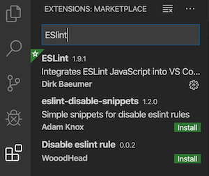
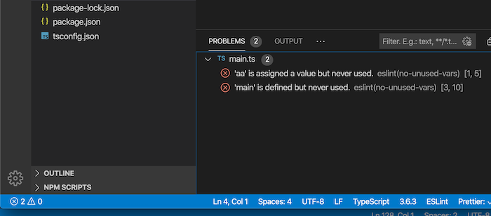

# Configuring Prettier, ESLint and Airbnb style for TypeScript projects in VSCode

## 1. Install `prettier` npm package

```
npm install --save-dev prettier
```

## 2. Turn on the Prettier extension in VSCode

Prettier is a code formatter and a VSCode extension. It allows teams to establish code formatting rules, and then it enforces those rules.


## 3. Configure VSCode

In Workspace setting, check on "Format on Save" . This creates a file in .vscode/settings.json
Add the following to the file


The file created in `.vscode/settings.json` contains the following settings. Make sure to include TypeScript specific settings.

```
    "editor.formatOnSave": true,
    "[javascript]": {
        "editor.formatOnSave": true
    },
    "[typescript]": {
        "editor.formatOnSave": true
    }
```

## 4. Create prettier config file called `.prettierrc.json`

Prettier configuration can exist in JSON or JavaScript. I prefer JSON. Add the following to your `.prettierrc.json` .

```
{
    "trailingComma": "es5",
    "tabWidth": 4,
    "semi": true,
    "singleQuote": true,
    "printWidth": 80
}

```

## 5. Test Prettier

Now comes the fun part! Create a file called main.ts and add the following code

```
var aa = "This should be in single quotes"
```

After you save the file, autoformatting should kick in and the code should look like (and notice the added semi-colon). You can see your `.prettierrc.json` file and rules at work here!

```
var aa = 'This should be in single quotes';
```

## 6. Install `eslint`

[ESLint](https://eslint.org/) is a tool for identifying and reporting on patterns found in ECMAScript/JavaScript code, with the goal of making code more consistent and avoiding bugs.

```
npm install eslint --save-dev
```

## 7. Generate `.eslintrc.json` config file

ESLint configuration can exist in JSON or JavaScript. I prefer JSON. There's an easy way to generate default configuration.

```
./node_modules/eslint/bin/eslint.js --init
```

## 8. Test `eslint`

Create a file called main.ts, and add the following code. This code breaks a few rules as recommended by default eslint rules.

```
var aa = "bb";

function main() {}
```

Execute `eslint` and generate errors

```
./node_modules/eslint/bin/eslint.js main.ts
```

You should see the following errors

```
  1:5   error  'aa' is assigned a value but never used  no-unused-vars
  3:10  error  'main' is defined but never used         no-unused-vars

✖ 2 problems (2 errors, 0 warnings)

```

## 9. Install ESLint extension in VSCode



## 10. Configure ESLint in `settings.json`

After installing ESLint extension in VSCode, add the following in your `.vscode/settings.json`

```
    "eslint.validate": [
        "javascript",
        "javascriptreact",
        "html",
        "typescript",
        "typescriptreact"
    ],
    "eslint.autoFixOnSave": true,
    "eslint.alwaysShowStatus": true
```

## 11. Test ESLint in VSCode

After enabling `eslint.validate` and `eslint.alwaysShowStatus`, we should see ESLint errors on the status bar in VSCode. See screenshot below:



## 12. Install config that prevents rules conflict between eslint and prettier

```
npm install --save-dev eslint-config-prettier
```

## 12. Install eslint plugin to integrate prettier rules into eslint

```
npm install --save-dev eslint-plugin-prettier
```

9. Configure prettier rules in eslintrc file

```
{
  "extends": ["prettier"],
  "plugins": ["prettier"],
  "rules": {
    "prettier/prettier": ["error"]
  },
}
```

10. Install @typescript-eslint/parser

```
npm install @typescript-eslint/parser --save-dev
```

11. Configure .eslintrc to use @typescript-eslint/parser parser

```
{
  "parser": "@typescript-eslint/parser",
  "plugins": ["@typescript-eslint"]
}
```

12. Install @typescript-eslint/eslint-plugin

```
npm i @typescript-eslint/eslint-plugin --save-dev
```
