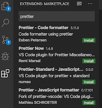
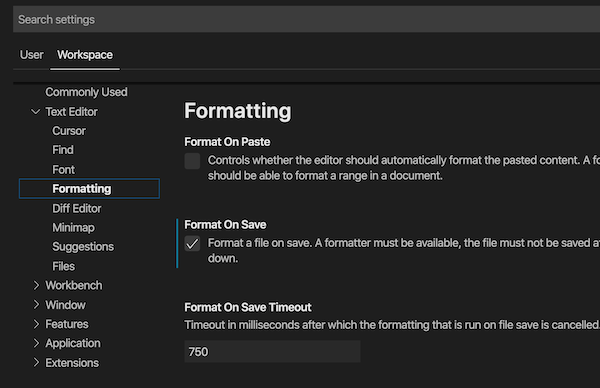

# Configuring Prettier, ESLint and Airbnb style for TypeScript projects in VSCode

## 1. Install `prettier` npm package

```
npm install --save-dev prettier
```

## 2. Turn on the Prettier extension in VSCode

Prettier is a code formatter and a VSCode extension. It allows teams to establish code formatting rules, and then it enforces those rules.



## 3. Configure VSCode

In Workspace setting, check on "Format on Save" . This creates a file in .vscode/settings.json
Add the following to the file



The file created in `.vscode/settings.json` contains the following settings. Make sure to include TypeScript specific settings.

```
    "editor.formatOnSave": true,
    "[javascript]": {
        "editor.formatOnSave": true
    },
    "[typescript]": {
        "editor.formatOnSave": true
    }
```

## 4. Create prettier config file called `.prettierrc.json`

Prettier configuration can exist in JSON or JavaScript. I prefer JSON. Add the following to your `.prettierrc.json` .

```
{
    "trailingComma": "es5",
    "tabWidth": 4,
    "semi": true,
    "singleQuote": true,
    "printWidth": 80
}

```

## 5. Install eslint

```
npm install --save-dev eslint
```

6. Generate eslintrc.json config file

```
./node_modules/eslint/bin/eslint.js --init
```

7. Install config that prevents rules conflict between eslint and prettier

```
npm install --save-dev eslint-config-prettier
```

8. Install eslint plugin to integrate prettier rules into eslint

```
npm install --save-dev eslint-plugin-prettier
```

9. Configure prettier rules in eslintrc file

```
{
  "extends": ["prettier"],
  "plugins": ["prettier"],
  "rules": {
    "prettier/prettier": ["error"]
  },
}
```

10. Install @typescript-eslint/parser

```
npm install @typescript-eslint/parser --save-dev
```

11. Configure .eslintrc to use @typescript-eslint/parser parser

```
{
  "parser": "@typescript-eslint/parser",
  "plugins": ["@typescript-eslint"]
}
```

12. Install @typescript-eslint/eslint-plugin

```
npm i @typescript-eslint/eslint-plugin --save-dev
```
